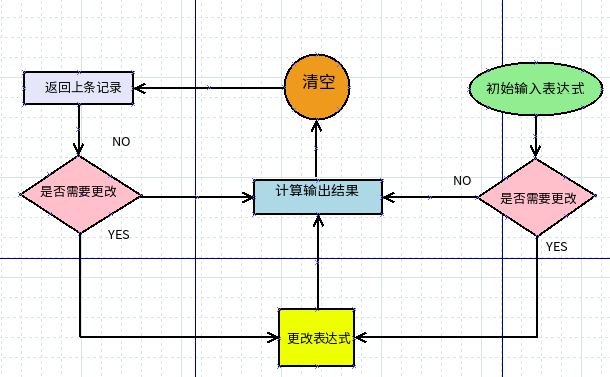
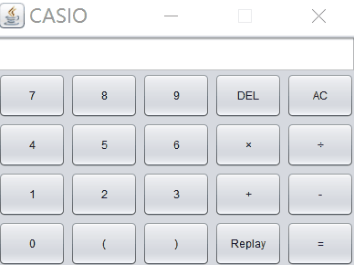

目录
=================
  * [Java 简易计算器](#java-简易计算器)
      * [GUI 源码](#gui-源码)
         * [效果](#效果)
      * [事件监听器源码](#事件监听器源码)
      * [计算器表达式算法](#计算器表达式算法)
      
# Java 简易计算器
[](https://github.com/Hephaest/Simple-Java-Caculator/blob/master/LICENSE)
[](https://www.oracle.com/technetwork/java/javase/8u202-relnotes-5209339.html)
[](https://github.com/Hephaest/Simple-Java-Caculator/tree/master/src)

[English](README.md) | 中文

要制作一个简易计算器，首先你要清楚GUI里要显示什么：
1. 结果显示框
2. 0～9的数字
3. 删除功能
4. 清楚功能
5. 搜寻历史记录功能
6. 计算结果的功能
7. 括号优先计算功能

接下来通过流程图简单介绍一下思路：

<p align="center"></p>

## GUI 源码

以下代码是根据我的设计来编写的
```java
/**
 * @author Hephaest
 * @since  2019/07/02
 * JDK 1.8
 */
import java.awt.BorderLayout;
import java.awt.Dimension;
import java.awt.GridLayout;
import javax.swing.JButton;
import javax.swing.JFrame;
import javax.swing.JPanel;
import javax.swing.JTextField;
import javax.swing.SwingConstants;
import javax.swing.UIManager;
/**
 * Calculator类用来创造GUI
 */
public class Calculator extends JFrame
{
  	//新建文本框
	JTextField text = new JTextField();
	JPanel row2 = new JPanel();
	//创建按钮们
	String[][] buttons = {{"7","8","9","DEL","AC"},{"4","5","6","×","÷"},{"1","2","3","+","-"},{"0","(",")","Replay","="}};
	JButton[][]button = new JButton[4][5];
	/**
	 * 这个计算机的界面我模拟的是卡西欧fx-82ES PLUS A
	 * 但是仅有其中的部分功能
	 */
	public Calculator()
	{
		super("CASIO");
		setSize(400,300);
		setDefaultCloseOperation(JFrame.EXIT_ON_CLOSE);
		setLayout(new BorderLayout());
		//设置文本框的尺寸、位置以及禁止键盘输入
		text.setPreferredSize(new Dimension(30, 40));
		text.setHorizontalAlignment(SwingConstants.TRAILING);
		text.setEditable(false);
		getContentPane().add(text, BorderLayout.NORTH);
		//声明每一个按钮代表的意义
		add(row2, BorderLayout.CENTER);
		GridLayout layout2 = new GridLayout(4,5,5,5);
		row2.setLayout(layout2);
		for(int i = 0; i < buttons.length; i++)
		{
			for(int j = 0; j < buttons[0].length; j++)
			{
				button[i][j] = new JButton(buttons[i][j]);
				row2.add(button[i][j]);
			}
		}
		add(row2);
		setResizable(false);
		setVisible(true);
	}
	
	private static void setLookAndFeel() 
	{
		//这条使跨操作系统也能看到计算机的GUI
        try {
            UIManager.setLookAndFeel(
                "com.sun.java.swing.plaf.nimbus.NimbusLookAndFeel"
            );
        } catch (Exception exc) {
            // ignore error
        }
    }
	
	public static void main(String[] args) 
	{
		Calculator.setLookAndFeel();
		Calculator cl = new Calculator();
		cl.listener();
	}
	/**
	 * 事件监听器，一旦按下按钮就要根据操作历史进行相应的反应
	 */
	public void listener()
	{
		Listener l = new Listener(this);
		for(int i = 0; i < buttons.length; i++)
		{
			for(int j = 0; j < buttons[0].length; j++)
			{
				button[i][j].addActionListener(l);
			}
		}
	}
}
```
### 效果

<p align="center"></p>

## 事件监听器源码
有了按钮后下一步就是要想办法实现按钮功能，我的思路在上面流程图里给过了，不再累赘，直接看如何利用代码实现：
```java
/**
 * @author Hephaest
 * @since  2019/07/02
 * JDK 1.8
 */
import java.awt.event.ActionEvent;
import java.awt.event.ActionListener;
import java.util.ArrayList;
import java.util.List;
import java.util.regex.Matcher;
import java.util.regex.Pattern;
import javax.swing.JButton;
import javax.swing.JTextField;
/**
 * Listener 类
 * 用来将按钮输入的结果通过链表的方式一个字一个字存储在字符串里，然后调用另一类计算整个字符串，返回一个值
 */
public class Listener implements ActionListener
{
	private Calculator cl;
	private ArrayList<String> list=new ArrayList<String>();
	private ArrayList<String> his=new ArrayList<String>();//这个链表用来添加每一次得到的最终的结果
	private ArrayList<String> arr = new ArrayList<String>();//把list里的一整串字符分割成单个字符，再连接
	private String[] arrayStr = new String[] {};//储存单次的历史记录
	private String out = "";
	private String output = "";
    
	public Listener(Calculator cl)
    {
    	this.cl = cl;
    }
    
	public void actionPerformed(ActionEvent event)
	{
		JButton button = (JButton) event.getSource();
		/**
		 * 如果点“=”，计算整个表达式的结果，如果是错误表达式，在文本框输入“Input Error!”
		 */
		if(button.getText().equals("="))
		{
			try
			{	
				Function f = new Function();
				double result = f.compute(out);
				cl.text.setText(Double.toString(result));
			} catch(Exception e) {
				cl.text.setText("Input Error!");
			}
		} else if(button.getText().equals("×")) {
        	/**
    		 * 如果点击"×"，先把它转换为"*"
    		 */
			if(list.isEmpty())
			{
				arr.add("*");
				output += "*";
				out = output;
				cl.text.setText(output);
			} else {
				list.add("*");
				output += "*";
				out = output;
				cl.text.setText(output);
			}
		} else if(button.getText().equals("÷")) {
        	    /**
		     * 如果点击"÷"，把它转换为"/"
		     */
			if(list.isEmpty())
			{
				arr.add("/");
				output += "/";
				out = output;
				cl.text.setText(output);
			} else {
				list.add("/");
				output += "/";
				out = output;
				cl.text.setText(output);
			}
		} else if(button.getText().equals("DEL")) {
        	    /**
		     * 如果点击"DEL"，删除表达式里最后一个字符，每点一次删一个
		     */
			if(list.isEmpty())
			{
				arr.remove(arr.size()-1);
		    		output = "";
	      			for(int i = 0; i < arr.size(); i++) output += arr.get(i);
	 			out = output;
	 			cl.text.setText(output);
			} else {
				list.remove(list.size()-1);
				String output = "";
				for(int i = 0; i < list.size(); i++) output+=list.get(i);
	 			out = output;
	 			cl.text.setText(output);
			}
		} else if(button.getText().equals("AC")) {
        	/**
    		 * 如果点击"AC"，删除list链表，再删除之前先把表达式保留到his的链表里
    		 */
			his.add(out);
			list.clear();
			output="";
 			cl.text.setText(output);
		} else if(button.getText().equals("Replay")) {
        	/**
    		 * 如果点击"Replay"，在文本框里显示上一条表达式
    		 */
			output=his.get(his.size()-1);
			cl.text.setText(output);
			arr.clear();
			//把上一条表达式分割成单个字符的字符数组
			char[] a=output.toCharArray();
			for(int i=0;i<a.length;i++)
			{
				arr.add(String.valueOf(a[i]));
			}
			his.remove(his.size()-1);
		} else {
        	/**
    		 * 其余按钮可以直接加入表达式
    		 */
			if(list.isEmpty())
			{
				arr.add(button.getText());
				output+=button.getText();
				out=output;
				cl.text.setText(output);
			} else {
				list.add(button.getText());
				output+=button.getText();
				out=output;
				cl.text.setText(output);
			}
		}
	}
}
```
## 计算器表达式算法

关于如何分析整个表达式并计算出正确值，实践了一下，还是后缀表达式比较方便，不用考虑括号这种优先级问题。对于理论算法不再这累赘了。在查阅资料的时候发现算法不管用栈还是正则等等，似乎只处理操作符是0～9的数，这是很不可取的。什么意思呢？就是像10/5这样的算数是没办法解决的，只能解决像5/5这样的。所以需要**先将中缀表达式转化成后缀并标记多位数的操作符**，然后在处理后缀表达式。

```java
/**
 * @author Hephaest
 * @since  2018/07/13
 * JDK 1.8
 */
import java.util.LinkedList;
import java.util.List;
import java.util.Stack;
public class function {
	private String[] str=new String[10];
	private int begin;
	public function(){}
	/**
	 * 中缀表达式转换成后缀表达式
	 * @param exp 在计算器上显示的文本 中缀表达式
	 * @return 正确的计算结果
	 */
	public double compute(String exp) 
	{
		char[] ch = exp.toCharArray();
		Stack <Character> stack = new Stack<>();
		String convertToPostfix = new String();
		int size = ch.length;
		begin = 0;
		for (int i = 0; i < size; i++) {
		  //遇到左括号直接入栈
		  if(ch[i] == '(') stack.push(ch[i]);
		  else if(ch[i] == ')') {
			//遇到右括号出栈(追加到后缀表达式), 直到出栈的元素为左括号或为0
			char popValue = stack.pop();
			do 
			{
			convertToPostfix = convertToPostfix.concat(String.valueOf(popValue));
			popValue = stack.pop();
			}while(!stack.isEmpty() && popValue != '(');
		  } else if(checkOperator(ch[i])) {
    		  /*
    		   * 遇到运算符需要判断：
    		   * 1.是否为空栈，是的话直接入栈
    		   * 2.即将入栈的运算符是否比栈顶元素优先级高
    		   * 	是，直接入栈
    		   *    否，栈顶元素出栈（追加到后缀表达式），当前运算符入栈
    		   */
			if(stack.isEmpty()) stack.push(ch[i]);
			else {
				char popValue = stack.pop();
				while(checkPriority(popValue,ch[i]))
				{
				  convertToPostfix = convertToPostfix.concat(String.valueOf(popValue));
				  if(stack.isEmpty()) break;
				  popValue = stack.pop();
				}
				if(!checkPriority(popValue,ch[i])) stack.push(popValue);
				stack.push(ch[i]);
			}
		  } else if(checkDigital(ch[i])) {
    		  /*
    		   * 单个数字直接追加到后缀表达式
    		   * 含有不止一个数字的操作符需要做记录：
    		   * 	1.计算该操作符的起始位置和终止位置
    		   * 	2.把数字传到字符串数组里（全局变量，下一步需要用到）
    		   */
			  if(i + 1 < size && i - 1 >= 0)
			  {
				  if(checkDigital(ch[i - 1]) && !checkDigital(ch[i + 1]))
				  {
					  int end = i;
					  int j = end;
					  while(checkDigital(ch[j]))
					  {
						  j--;
					  }
					  j++;
					  List<String> elements = new LinkedList<>();
					  do
					  {
						  elements.add(String.valueOf(ch[j]));
						  j++;
					  } while(j <= end);
					  str[begin] = String.join("", elements);
					  System.out.println(str[begin]);
					  begin++; 
				  }
			  }
			  convertToPostfix=convertToPostfix.concat(String.valueOf(ch[i]));
		    }
		 }
		//第一遍结束后把栈中剩下的操作符依次出栈（追加到后缀表达式）
		while(!stack.isEmpty())
		{
			char popValue = stack.pop();
			convertToPostfix = convertToPostfix.concat(String.valueOf(popValue));
		}
		System.out.println(convertToPostfix);
		return computeResult(convertToPostfix);
	}
	
  	/**
	 * 计算后缀表达式
	 * @param convertToPostfix 后缀表达式的字符串
	 * @return 计算结果
	 */
	public double computeResult(String convertToPostfix)
	{
		int[] index=new int[10];
		/*
		 * 判断是否有多位数的操作符，有的话找到在后缀表达式的初始位置
		 * 如果没有的话就不会执行
		 */
		for(int i = 0;i < begin; i++)
		{
			index[i] = convertToPostfix.indexOf(str[i]);
			System.out.println(index[i]);
		}
		char[] ch = convertToPostfix.toCharArray();
		Stack <Double> stack = new Stack<>();
		double result = 0;
		for (int i = 0; i < ch.length; i++) {
			//如果是运算符，pop出栈顶的两个元素，记住先进后出
			if(checkOperator(ch[i]))
			{
				double num2=stack.pop();
				System.out.println("num2" + num2);
				System.out.print("\n");
				double num1=stack.pop();
				System.out.println("num1" + num1);
				System.out.print("\n");
				switch(ch[i])
				{
					case '*':
						result = num2 * num1;
						break;
					case '/':
						result = num1 / num2;
						break;
					case '+':
						result = num1 + num2;
						break;
					case '-':
						result = num1 - num2;
						break;
				}
				System.out.println(result);
				stack.push(result);
			} else {
      			/*
			 * 对于多位操作符，需要把单个字符连接起来然后作为一个双精度数放入栈中
			 * 一位数的操作符直接放入栈即可，注意从字符变成数字时要减去48(0的字符型数据)
			 */
				int stop = 0;
				for(int j = 0; j < begin; j++)
				{
					if(i == index[j])
					{
						int start=i;
						List<String> elements = new LinkedList<>();
						do
						{
							elements.add(String.valueOf(ch[i]));
							i++;
						} while(i < str[j].length() + start);
						i--;
						String test=String.join("", elements);
						stack.push(Double.valueOf(test));
						stop=1;
						break;
					}
				}
				if(stop == 0) stack.push((double)ch[i]-48);
			}
		}
		System.out.print("\n");
		System.out.print(result);
		return result;
	}
	
  	/**
	 * 判断是否是运算符
	 * @param c 当前字符
	 * @return 布尔型结果
	 */
	public boolean checkOperator(char c)
	{
		int result;
		switch(c)
		{
			case '+':
			case '-':
			case '*':
			case '/':
				result = 1;
				break;
			default:
				result = 0;
		}
		if(result == 1) return true;
		else return false;
	}
	
 	/**
	 * 判断是否是数字
	 * @param c 当前字符
	 * @return 布尔型结果
	 */
	public boolean checkDigital(char c)
	{
		int num = c;
		num -= 48;
		if(num >= 0 && num <= 9) return true;
		else return false;
	}
	
 	/**
	 * 判断即将入栈的优先级是否更高
	 * @param popOne 栈顶元素
	 * @param checkOne 即将入栈元素
	 * @return 布尔型结果
	 */
	public boolean checkPriority(char popOne,char checkOne)
	{
		if((popOne == '*' || popOne == '/') && (checkOne == '+' || checkOne == '-')) return true;
		else if(popOne == checkOne) return true;
		else return false;
	}
}

```
